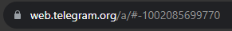

# For Support Join my Discord Server
[](https://discord.gg/a5X7bv3HF4)


# Lupin Documentation


## ✨ About ✨

Lupin stands as the forefront password and cookie scraper, redefining the landscape of data analysis with its sophisticated features tailored for unparalleled efficiency and customization.


### Key Features:

**Telegram Integration**: <br>
Seamlessly manage data scraping operations through Telegram.


**Both Client and Server Mode**: <br>
Use Lupin as a client or server for tailored data harvesting flexibility.


**Automated File Processing**: <br>
Effortlessly download, convert, and scan logs for efficient workflow.


**Custom Data Analysis**: <br>
Advanced algorithms enable precise scanning of multiple domains and cookies simultaneously.


**Database Management**: <br>
Intelligent database system avoids duplicates for organized and accurate findings.


**Automated Telegram Posting**: <br>
Lupin posts findings directly into your configured Telegram chat for real-time updates.

Customize your search parameters for a truly tailored data analysis experience.

## ⚡ Getting Started ⚡

This section will guide you through the installation process to get your software up and running smoothly.

### 1. 💾 Downlaod and Run
- Simply clone the repository
- change directory by using  ```cd ./src```
- run ```py ./Server.py```

<br>

---

### 2. 🌐 Setup api_config.json

##### 2.1. ```"api_id"``` and ```"api_hash"```
- Log in to your Telegram core: https://my.telegram.org <br> **Note**: We recommend using a new telgram account exclusivly for Lupin!
- Go to "**API development tools**" and fill out the form. 
- You will get basic addresses as well the **api_id** and **api_hash** parameters required for user authorization.

##### 2.2. ```"chat_id"``` <br>
- Go to https://web.telegram.org
- Open a **group chat** where you want Lupin's search results to be posted in. <br> **Note**: We recommend creating a new group chat!
- Look at the URL at the top of the screen. The digits are actually your chat ID.  <br> 
- Just make sure to **include a "-"** in front of the numbers.

##### 2.3. ```"bot_token"``` 
- Find the telegram bot named [@botfather](https://t.me/BotFather)
- He will help you with creating and managing your bot.
- Copy & paste your **bot_token**

##### This is an example of what your finished config should look like: 
```json
{
    "api_id" : "12345678",
    "api_hash" : "0123456789abcdef0123456789abcdef",

    "chat_id" : "-1234567890123",
    "bot_token" : "0123456789:AaBbCcDdEeFfGgHhIiJjKkLl01234567890"
}
```

<br>

---

### 3. 🔐 Setup password_search_config.json

- The password_search_config should be filed with so called **key-value-pairs**
  As your **key** you should use a **UNIQUE name** that fits your **domain** (value)<br> 
  - The name for your **key** is going to be used in order to store **all results** of the **respective domain** (value) inside a **database** of the **same name**. <br>
  - Therefore you should **not change the name of your key after** you have defined a **combination** of a **key** (name) and **value** (domain), or else duplicate findings **won't be detected correctly**.
- As your **value** you should only use the **root-domain** name
    - [✘] ```"Google" : "https://www.google.com/"```
    - [✓] ```"Google" : "google.com"```
    - [✓] ```"Outlook" : "login.outlook.live"```

##### This is an example of what your finished config should look like: 
```json
{
    "Google": "google.com",
    "Outlook": "outlook.live.com"
}
```

<br>

---

### 4. 🍪 Setup cookie_search_config.json

- Analogus to the password_search_config you should give each cookie you want to search for a **UNIQUE name**
- Now you can set the three values "**domain**", "**pattern**" and "**amount**"

##### 3.1. ```"domain"```
- As the name suggests you need to specify the **domain of the cookie** you want to search for <br>
**Note**: Be sure to use the correct format! (check password_search_config for reference)

##### 3.2. ```"pattern"```
- This specifies the exact **type of cookie** you want to search for. 
- The pattern could be anything, but most of the times you want to search for specific login cookies that save some sort of login key (this key is named different for every site). <br>
**Note**: Most of the times its called something like "*SSID*", "*session_id*", "*auth_token*", etc.

##### 3.3. ```"amount"```
- This can be set to 3 different values: **"all"**, **"multi"** or **"single"** <br>
This value specifies how the **pattern** is going to be used in your search

- ```"all"``` <br> 
  - The pattern is actually **ignored** here! <br>
  - It means that you don't care for any specific cookie and just want to **get each and every cookie** that can be found under the specified **domain**. <br>
**Note**: In this case you could leave the pattern empty like this: ```"pattern" : ""```

- ```"single"``` <br> 
  - This only looks for the specified pattern and will **ONLY extract the cookies** which match the **domain and pattern**.

- ```"multi"``` <br> 
  - You can imagine this as if it puts **every** cookie from the specified domain into a bucket/list. <br> 
  - Then it checks if the **pattern** (for example an auth_token) is somewhere present inside the bucket <br> 
  - Now it will **only return** the bucket/list if the **pattern is present** inside. <br> 
**Note**: You can think of it as the combination of **"*single*"** and **"*all*"**.

##### This is an example of what your finished config should look like: 
```json
{
	"Stripe" : {
       "domain" : "stripe.com",
       "pattern" : "SSID",
       "amount" : "single"
   },
	"PayPal" : {
       "domain" : "paypal.com",
       "pattern" : "",
       "amount" : "all"
   },
	"GitHub" : {
       "domain" : "github.com",
       "pattern" : "auth_token",
       "amount" : "multi"
   }
}
```

<br>

---

### 5. 📝 Setup server_config.json

##### 4.2. ```"root_folder_path"```
- Lupin will go through **each file** within the **root_folder** and check if its compatible.
- This specifies the path to the folder which contains all the log files you want to scan **localy** <br> **Note**: As of version 1.5 **only** (non password protected) .ZIP files are supported

##### This is an example of what your finished config should look like: 
```json
{
    "root_folder_path": "C:/Your/Path/To/RootFolder"
}
```

<br>

---

### 6. 💻 Starting Lupin for the first time

Once the authentication is successful you are able to **choose the wroking mode** you want Lupin to run in: <br>

**Telegram Mode:** <br>
- In this mode you are able to **foreward messages** to the **Telegram account** you have connected previously using an **api_hash** and **api_id** <br>
- Lupin will then check if the message contains a compatible file and starts downloading and searching automatically. <br>
- **Note**: As of version 1.5 ONLY the following **files types** are **supported in Telegram Mode**:
  - password protected .RAR files 
  - unprotected .RAR files 
  - unprotected .ZIP files 
- **Important**: <br> 
When starting Lupin for the first time you will be promted to enter a **phone Number**. <br>
The phone number required is the one which **corresponds** to the Telgram account you have connect earlier via your **api_hash** and **api_id**. <br>
After entering your phone number correctly you are required to **provide a verification code** in order to authenticate your telegram account to Lupin.
<br>
<br>

**Local Mode:** <br>
- In this mode lupin will show you the **number of files** it has found inside of the **root_folder** you have specified earlier.
- At this point you can simply hit enter and Lupin will start scanning each log file that is compatible and automatically skip the ones that are incompatible.
- **Note**: As of version 1.5 ONLY the following **files types** are **supported in Local Mode**:
  - unprotected .ZIP files 

<br>

---

<br> <br>

## 📝 Todo 📝

- wallet scraping
- timestamp forging
- discord token scraping
- filter search entries by geo location
- support password protected .zip files
- support .7z files
- support password protected .7z files
- verify Telegram api tokens before start
- support multiple stealer formats (currently only RedLine Stealer) 
